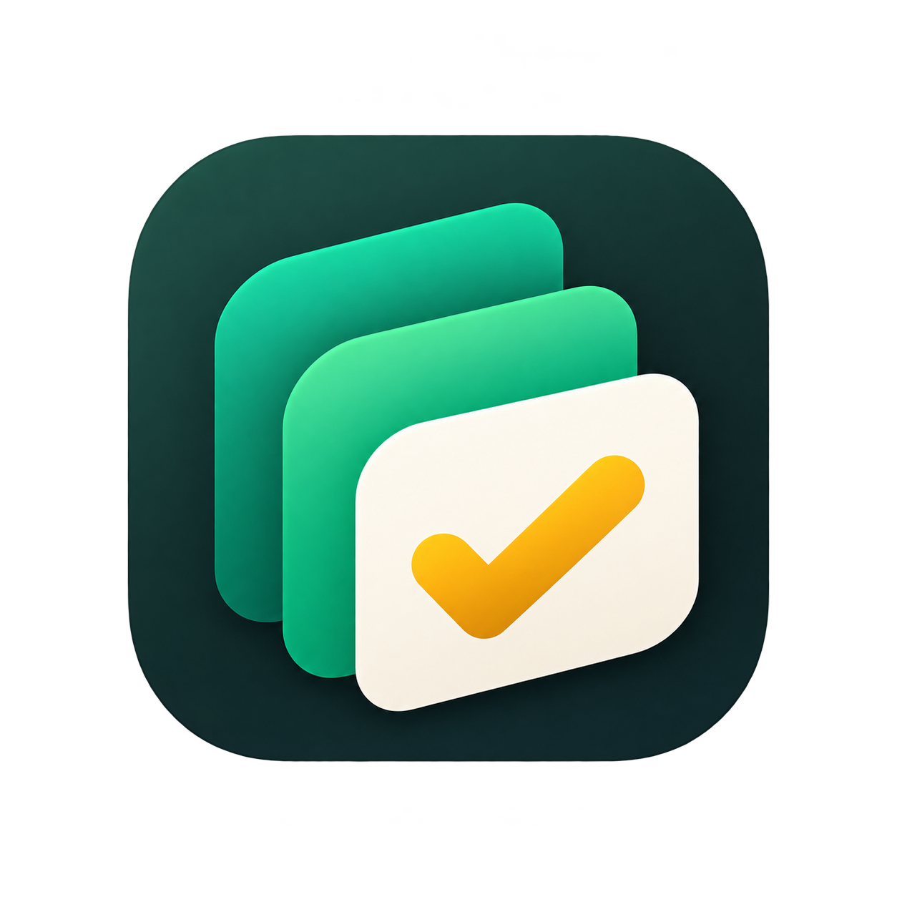

<p align="center">
  
</p>

<h1 align="center">ZenTask</h1>

<p align="center">
  A role-aware project and task management workspace built with React, TypeScript, Vite, and Supabase.
</p>

<p align="center">
  <a href="https://zen-task-manager.vercel.app"><strong>Live Demo</strong></a>
  ·
  <a href="#features">Features</a>
  ·
  <a href="#architecture">Architecture</a>
  ·
  <a href="#local-development">Run Locally</a>
</p>

---

## Overview

ZenTask is a focused project-delivery workspace designed around clear ownership, controlled task handoffs, and role-aware collaboration.

Instead of treating task management as simple CRUD, ZenTask models a real delivery workflow:

- administrators manage projects, memberships, tasks, and review decisions;
- members work only on tasks assigned to them;
- submissions move through an explicit review stage;
- PostgreSQL Row Level Security and database triggers enforce the rules independently of the UI.

The frontend uses **React 19 + TypeScript + Vite**, while **Supabase Auth, PostgreSQL, Realtime, and RLS** provide the backend and authorization layer.

## Features

| Area | What ZenTask supports |
| --- | --- |
| Authentication | Email/password sign-up and sign-in, persisted sessions, password recovery |
| Roles | Admin and Member experiences with database-enforced authorization |
| Projects | Create, edit, delete, assign members, dates, status, and progress |
| Tasks | Assignment, priority, deadlines, search, filters, sorting, task details |
| Review workflow | Member submission with required work summary, admin completion or return |
| Activity | Workspace activity feed and task-specific activity history |
| Realtime | Automatic refresh for projects, memberships, and tasks |
| UX | Responsive app shell, accessible dialogs, toasts, empty/loading/error states |
| Design | Graphite, emerald, amber, and warm-ivory visual system with custom ZenTask branding |

## Task workflow

For an assigned member:

```text
To Do → In Progress → Ready For Review
```

Submitting a task for review requires a non-empty work summary.

An administrator can then:

```text
Ready For Review → Completed
                 ↘ In Progress
```

The UI guides the workflow, but the database trigger `enforce_task_workflow` is the final authority.

## Roles and permissions

### Admin

Admins can:

- create, edit, and delete projects;
- manage project membership;
- create, assign, edit, and delete tasks;
- review submitted work;
- complete a task or return it to **In Progress**;
- update registered users' workspace roles.

### Member

Members can:

- view projects they are allowed to access;
- view project tasks and activity permitted by RLS;
- update only their own assigned task's status and work summary;
- move tasks through **To Do → In Progress → Ready For Review**.

Members cannot edit protected task fields such as title, project, assignee, priority, or due date.

## Architecture

```text
ZenTask_Manager/
├── frontend/
│   ├── public/
│   │   └── brand/               ZenTask logo and app icon
│   ├── src/
│   │   ├── app/                 router and application providers
│   │   ├── components/          shared layout and UI primitives
│   │   ├── features/
│   │   │   ├── auth/
│   │   │   ├── dashboard/
│   │   │   ├── projects/
│   │   │   ├── tasks/
│   │   │   └── team/
│   │   ├── hooks/               shared React hooks
│   │   ├── lib/supabase/        Supabase client and database mapping
│   │   ├── services/            data-access and auth services
│   │   ├── styles/              global design system and responsive UI
│   │   ├── types/               domain models
│   │   └── utils/               workspace helpers
│   ├── package.json
│   ├── vercel.json
│   └── vite.config.ts
│
└── backend/
    └── supabase/
        └── migrations/           PostgreSQL schema, RLS, triggers, workflow rules
```

There is intentionally **no Express/Node API layer**. Supabase and PostgreSQL are the backend and authorization authority.

## Tech stack

### Frontend

- React 19
- TypeScript
- Vite
- React Router
- Lucide React
- CSS design system

### Backend

- Supabase Auth
- PostgreSQL
- Row Level Security
- Supabase Realtime
- PostgreSQL triggers

### Deployment

- Vercel

## Security and authorization

ZenTask does not rely on hidden buttons or client-side role checks as its security boundary.

RLS is enabled on:

- `profiles`
- `projects`
- `project_members`
- `tasks`
- `activity_logs`

Important rules include:

- members only read projects and related data they are allowed to access;
- a task assignee must belong to that task's project;
- removing a project member with assigned tasks is blocked until those tasks are reassigned;
- assigned members can update only status and work summary;
- invalid member status transitions are rejected in PostgreSQL;
- a work summary is required before a member can submit for review;
- administrators retain broader task-management authority.

Client-side visibility improves usability. **RLS and database triggers enforce the actual permissions.**

## Authentication and recovery

ZenTask uses Supabase Auth for session management.

Supported flows:

- account creation;
- sign in;
- persisted authentication;
- sign out;
- forgot-password request;
- recovery-link validation;
- password update and recovery-session sign-out.

For hosted password recovery, the application's `/reset-password` route must be included in the Supabase Auth redirect allow list.

## Local development

### 1. Create a Supabase project

Create a new Supabase project and open the SQL Editor.

### 2. Apply migrations

Run these migrations in order:

1. [`202606010001_initial_schema.sql`](backend/supabase/migrations/202606010001_initial_schema.sql)
2. [`202606010002_validate_task_assignee.sql`](backend/supabase/migrations/202606010002_validate_task_assignee.sql)
3. [`202606010003_bootstrap_admin_and_membership_guard.sql`](backend/supabase/migrations/202606010003_bootstrap_admin_and_membership_guard.sql)
4. [`202606020001_task_review_workflow.sql`](backend/supabase/migrations/202606020001_task_review_workflow.sql)

Do not skip the fourth migration; it contains the review-workflow policies and enforcement trigger.

### 3. Configure the frontend

```bash
cd frontend
cp .env.example .env.local
```

Set:

```env
VITE_SUPABASE_URL=https://your-project.supabase.co
VITE_SUPABASE_ANON_KEY=your-anon-key
```

Only browser-safe Supabase values belong here.

Never expose `SUPABASE_SERVICE_ROLE_KEY` through a `VITE_` variable or frontend code.

### 4. Install and run

```bash
npm install
npm run dev
```

The Vite development server will print the local URL.

## Available scripts

Run from `frontend/`:

```bash
npm run dev          # start the Vite development server
npm run format       # format frontend files and README
npm run format:check # verify Prettier formatting
npm run typecheck    # run TypeScript validation
npm run build        # typecheck + production Vite build
npm run preview      # preview the production build
```

## Deployment

The live application is deployed with Vercel:

**https://zen-task-manager.vercel.app**

Vercel project configuration:

```text
Framework Preset: Vite
Root Directory: frontend
Build Command: npm run build
Output Directory: dist
```

Required environment variables:

```text
VITE_SUPABASE_URL
VITE_SUPABASE_ANON_KEY
```

[`frontend/vercel.json`](frontend/vercel.json) provides the SPA rewrite needed for direct BrowserRouter route refreshes.

For password recovery, configure the production Site URL and add:

```text
https://your-domain/reset-password
```

to the Supabase Auth redirect allow list.

## Main routes

```text
/login
/reset-password
/dashboard
/projects
/projects/:projectId
/tasks
/team
```

## Product design

ZenTask uses a restrained visual system rather than a component-library theme:

- **Graphite** for the application frame and navigation;
- **Emerald** for primary actions and active states;
- **Amber** for review and warning states;
- **Warm Ivory** for the main application canvas;
- semantic success and danger colors for completion and destructive states.

The interface includes responsive navigation, keyboard-visible focus states, accessible dialogs with focus trapping/restoration, reusable toast feedback, and mobile layouts.

## Current limitations

ZenTask currently does not include:

- invitation emails or administrative user provisioning;
- task attachments;
- a dedicated notification center;
- audit export;
- automated browser E2E coverage;
- automated Supabase RLS integration tests.

Users currently create an account before an administrator can update their workspace role.

## Roadmap

Potential next steps:

- trusted invitation flow using a Supabase Edge Function or Vercel serverless function;
- Playwright coverage for auth, member handoff, and admin review flows;
- SQL/RLS regression testing against a disposable Supabase project;
- notifications and pagination for larger workspaces;
- file attachments and richer audit reporting.

## Author

**Utkarsh Verma**

ZenTask was designed and built as a full-stack project-management workspace focused on practical authorization, workflow enforcement, and a polished product experience.

<p align="center">
  <strong>© 2026 ZenTask · Built by Utkarsh Verma</strong>
</p>
